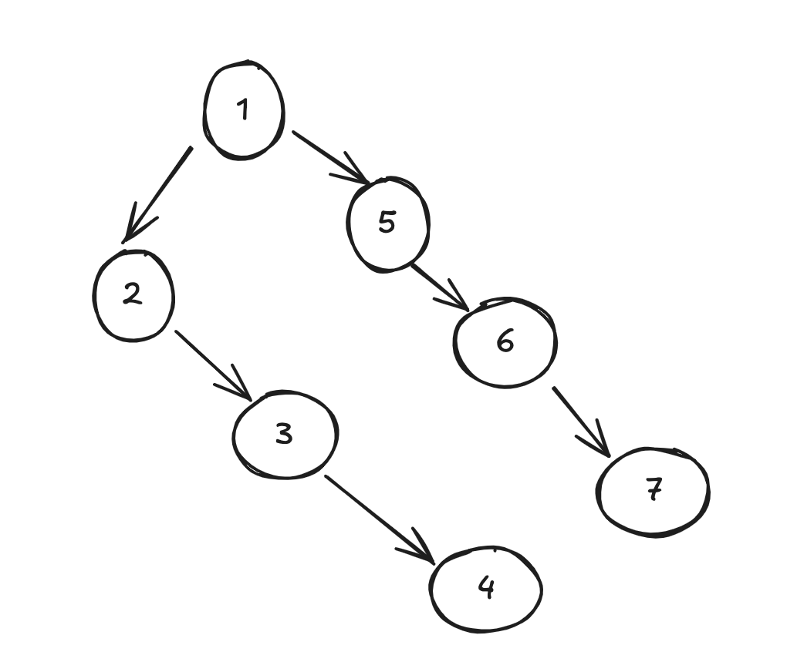
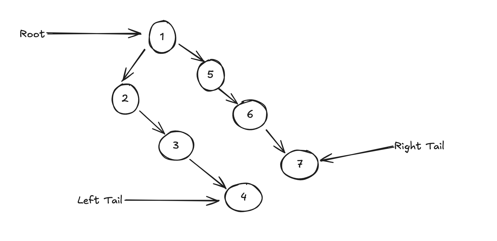
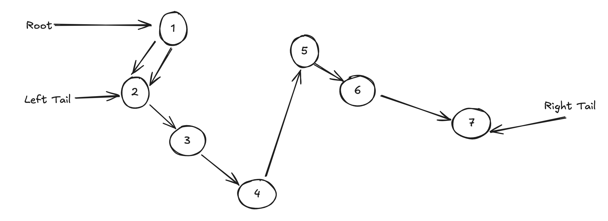

## Flatten Binary Tree Linked List
**Undeerstand**
Given the root of a binary tree, flatten the tree into a "linked list". This should be done in such a way that:
- all nodes should be connected only via the right pointers
- all nodes connection maintain the preorder traversal of the original tree
i.e

```
    1
   / \
  2   5
 / \    \
3   4    6
``` 
becomes...
```
    1
     \
      2
       \
        3
         \
          4
           \
            5
             \
              6
```

**Match**
This problem combines knoledge of binary trees specifically Preorder Traversal as well as imagery of how a linked list is or should be.

Each node would be converted from having two children to having one child as described in the problem. 
This problem would be solved in subproblems - recursively (Divide and Conquer)
**How**:
- For the root node, we flatten the left subtree and the right subtree
- we connect the left flattened list to be in-between the root node and the right flattened list 

**Plan**
- Define an helper function to flatten a tree

- Add the base case for null nodes

- Recursively get the left tail

- Recursively get the right tail

- if the left tail exists:
    - connect its right pointer to the right of the root
    - connect the roots right to the head of the flattened left list (root.left)
    - set the root's left to None

- Return the overall tail right tail  else the left tail else the right tail


**Implement**
```py
# Definition for a binary tree node.
# class TreeNode:
#     def __init__(self, val=0, left=None, right=None):
#         self.val = val
#         self.left = left
#         self.right = right
class Solution:
    def flatten(self, root: Optional[TreeNode]) -> None:
        """
        Do not return anything, modify root in-place instead.
        """
        def merge_tail(root):
            if not root:
                return None
            
            left_tail = merge_tail(root.left)
            right_tail = merge_tail(root.right)

            if left_tail:
                left_tail.right = root.right
                root.right = root.left
                root.left = None
            
            return right_tail or left_tail or root
        merge_tail(root)
```

**Visualization**





**Review**
- The algorithm matches and passes all testcases on Leetcode
- It correctly handles null heads, no left subtree, no right subtree and both sub subtrees present or absent.

**Evaluate**
- Time Complexity O(N) - It recursively treats every node of the tree as a subtree.

- Space Complexity O(H) - this is the number of recursive stacks based on the height of the binary tree, but in the worst case (a flattened linked list) it would be O(N)

**Pattern**
- Treat each subtree as its own tree that needs to be flattened
- Recursively get the tail of each subtree
- Connect them in preorder manner `node -> left -> right`