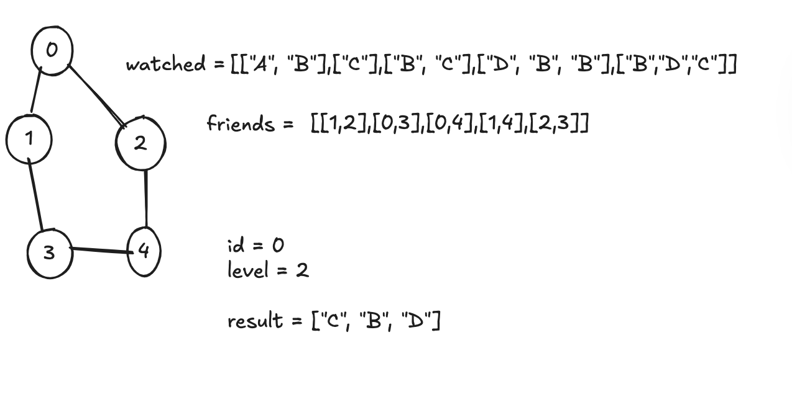

## Get Watched Videos by Your Friends

**Understand**
There are n people, each person has a unique id between 0 and n-1. Given the arrays watchedVideos and friends, where watchedVideos[i] and friends[i] contain the list of watched videos and the list of friends respectively for the person with id = i.

Level 1 of videos are all watched videos by your friends, level 2 of videos are all watched videos by the friends of your friends and so on. In general, the level k of videos are all watched videos by people with the shortest path exactly equal to k with you. Given your id and the level of videos, return the list of videos ordered by their frequencies (increasing). For videos with the same frequency order them alphabetically from least to greatest.



**Match**
This is a graph traversal + counting + sorting problem.

BFS is used to find friends at the given level.

Frequency map counts movies from those friends.

Sort by (frequency, name).

**Plan**

Define helper getMovies(friends) to:

Build frequency dictionary of movies from given friends.

Sort by (count, movie name).

Return sorted list of movie names.

Perform BFS starting from id.

Track visited set to avoid cycles.

Stop when reaching the given level.

Return movies from those friends.

```py
from collections import deque

class Solution:
    def watchedVideosByFriends(self, watchedVideos: List[List[str]], friends: List[List[int]], id: int, level: int) -> List[str]:
        def getMovies(friends_list):
            movies = {}
            for f in friends_list:
                for mv in watchedVideos[f]:
                    movies[mv] = movies.get(mv, 0) + 1
            mvs = sorted([(cnt, mv) for mv, cnt in movies.items()], key=lambda x: (x[0], x[1]))
            return [m[1] for m in mvs]

        q = deque([id])
        visited = {id}
        l = 1

        while q:
            lvl = []
            for _ in range(len(q)):
                cur = q.popleft()
                for nei in friends[cur]:
                    if nei not in visited:
                        q.append(nei)
                        lvl.append(nei)
                        visited.add(nei)
            if l == level:
                return getMovies(lvl)
            l += 1
```

**Review**

BFS ensures correct friend level traversal.

visited prevents revisiting.

Sorting step ensures output matches requirements.
